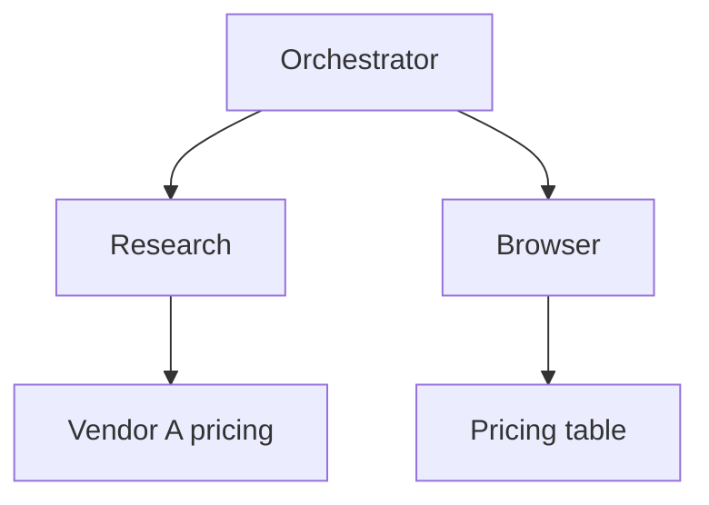

<p align="center">
  
</p>

<p align="center">
  <strong>Remember what your agents already found.</strong>
</p>

<p align="center">
  Local-first memory over Claude, GPT/Codex, and Cursor runs on this machine.<br />
  Archive the original logs, collapse them into what each step obtained, and keep the DAG as the receipt.
</p>

<p align="center">
  <a href="https://github.com/acradin/trainthon"></a>
  &nbsp;
  
  &nbsp;
  
</p>

---

# DeepTracer

Agents forget each other. Claude’s session does not see Codex. Cursor does not see last week’s Claude run. DeepTracer keeps those logs on **this computer**, compresses tool calls into meaning, and is the store you query next.

It is not a JSON paste box. You register desktop agents. A local Next.js server reads session files here:

```text
Register agents  →  archive sessions  →  meaning graph  →  receipt DAG
```

A hosted Vercel/Netlify site cannot open `~/.claude`, `~/.codex`, or `~/.cursor`. That is the product, not a limitation to work around.



Nodes are **what a step obtained** — a source, a file, a page — not `Search ×4`. The graph is the compressed memory. Open a node when you need the original.

## Who it reads

| Agent | Desktop app | Logs |
| --- | --- | --- |
| Claude | Claude | `~/.claude/projects`, `~/.claude/transcripts` |
| GPT | ChatGPT / Codex | `~/.codex/sessions` |
| Cursor | Cursor | `~/.cursor/projects/*/agent-transcripts` |

Only installed desktop apps are listed. Credentials, auth files, and SQLite chat DBs are ignored.

## Quick start

```bash
git clone https://github.com/acradin/trainthon.git
cd trainthon/deeptracer
npm install
npm run dev
```

Open [http://localhost:3000](http://localhost:3000). Register the agents on this machine. Runs appear without uploading JSON.

Optional `deeptracer/.env.local` (do not commit):

```env
OPENAI_API_KEY=
OPENAI_MODEL=gpt-5.6-luna
```

Review intent and meaning-graph compression use OpenAI when a key is present. Without it, traces still scan and open. Default storage is `~/.deeptracer`.

## Screens

| Path | Role |
| --- | --- |
| `/` | Product landing |
| `/onboard` | Register desktop agents |
| `/dashboard` | Runs, grouped by project |
| `/trace/[id]` | Meaning graph (receipt), Inspector, Timeline |
| `/agents` | Status + Scan now |
| `/analyze` | Example traces and intent review |
| `/import`, `/setup` | Manual JSON / OTLP fallbacks |

## Privacy

- Logs stay on the machine running `npm run dev`.
- The scanner reads session transcripts only.
- Nothing is uploaded unless you add your own OpenAI/Supabase keys.

## Docs

App code lives in [`deeptracer/`](deeptracer/).

- [Product requirements](deeptracer/docs/PRD.md)
- [Design system](deeptracer/docs/design-system.md)
- [DAG guidelines](deeptracer/docs/DESIGN.md)
- [App README](deeptracer/README.md)

## Trainthon

Built for Cursor Korea × Yonsei University Startup Support Group **Trainthon**.
