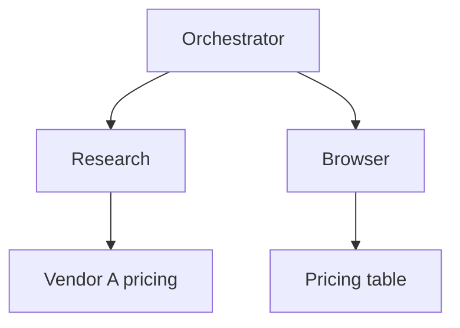

<p align="center">
  
</p>

<p align="center">
  <strong>Don’t debug the output. Trace the cause.</strong>
</p>

<p align="center">
  Local-first debugger for Claude, GPT/Codex, and Cursor agent runs.<br />
  Register the desktop apps on this machine, scan their session logs, and follow the DAG to the first off-intent step.
</p>

<p align="center">
  <a href="https://github.com/acradin/trainthon"></a>
  &nbsp;
  
  &nbsp;
  
</p>

<p align="center">
  <a href="#deeptracer">English</a> · <a href="#한국어">한국어</a>
</p>

---

# DeepTracer

Most agent tools show the last message. DeepTracer shows **why the run went off intent**.

It is not a JSON paste box. You register desktop agents. A local Next.js server reads session files on **this computer** and turns them into runs:

```text
Register agents  →  scan sessions  →  Runs by project  →  DAG + Inspector
```

A hosted Vercel/Netlify site cannot open `~/.claude`, `~/.codex`, or `~/.cursor`. That is the product, not a limitation to work around.



Nodes are **what a step obtained** — a source, a file, a page — not `Search ×4`. Sub-agents stay as branches. Review intent finds where the run drifted.

## Who it reads

| Agent | Desktop app | Logs |
| --- | --- | --- |
| Claude | Claude | `~/.claude/projects`, `~/.claude/transcripts` |
| GPT | ChatGPT / Codex | `~/.codex/sessions` |
| Cursor | Cursor | `~/.cursor/projects/*/agent-transcripts` |

Only installed desktop apps are listed. Credentials, auth files, and SQLite chat DBs are ignored.

## Quick start

```bash
git clone https://github.com/acradin/trainthon.git
cd trainthon/deeptracer
npm install
npm run dev
```

Open [http://localhost:3000](http://localhost:3000). Register the agents on this machine. Runs appear without uploading JSON.

Optional `deeptracer/.env.local` (do not commit):

```env
OPENAI_API_KEY=
OPENAI_MODEL=gpt-5.6-luna
```

Review intent uses OpenAI when a key is present. Without it, traces still scan and open as a DAG. Supabase is optional; default storage is `~/.deeptracer`.

## Screens

| Path | Role |
| --- | --- |
| `/` | Product landing. Locale: Korea → Korean, otherwise English |
| `/onboard` | Register desktop agents |
| `/dashboard` | Runs, grouped by project |
| `/trace/[id]` | Execution DAG, Inspector, Timeline |
| `/agents` | Status + Scan now |
| `/analyze` | Example traces and intent review |
| `/import`, `/setup` | Manual JSON / OTLP fallbacks |

## Privacy

- Logs stay on the machine running `npm run dev`.
- The scanner reads session transcripts only.
- Nothing is uploaded unless you add your own OpenAI/Supabase keys.

## Docs

App code lives in [`deeptracer/`](deeptracer/).

- [Product requirements](deeptracer/docs/PRD.md)
- [Design system](deeptracer/docs/design-system.md)
- [DAG guidelines](deeptracer/docs/DESIGN.md)
- [App README](deeptracer/README.md)

## Trainthon

Built for Cursor Korea × Yonsei University Startup Support Group **Trainthon**.

---

# 한국어

**출력을 디버깅하지 마세요. 원인을 추적하세요.**

DeepTracer는 이 컴퓨터의 Claude, GPT, Cursor 데스크톱 로그를 읽어 실행을 DAG로 엽니다. JSON을 붙여넣는 제품이 아닙니다. 에이전트를 등록하면 로컬 세션을 스캔합니다.

클라우드 배포만으로는 사용자 PC의 `~/.claude`, `~/.codex`, `~/.cursor`에 접근하지 못합니다. 로그를 읽는 주체는 브라우저가 아니라 **이 PC에서 돌아가는 Next 서버**입니다.

```bash
git clone https://github.com/acradin/trainthon.git
cd trainthon/deeptracer
npm install
npm run dev
```

[http://localhost:3000](http://localhost:3000)에서 에이전트를 등록하세요. 한국이면 랜딩이 한글로, 그 외에는 영어로 열립니다.
